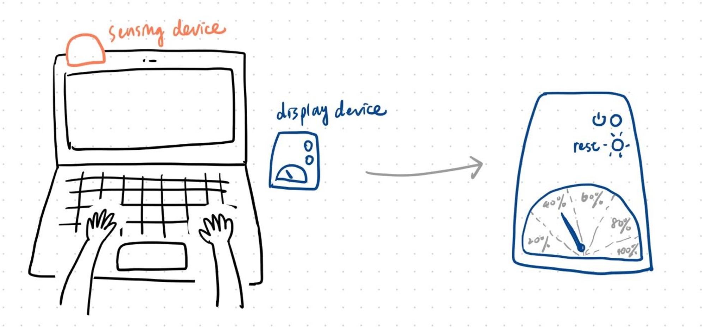
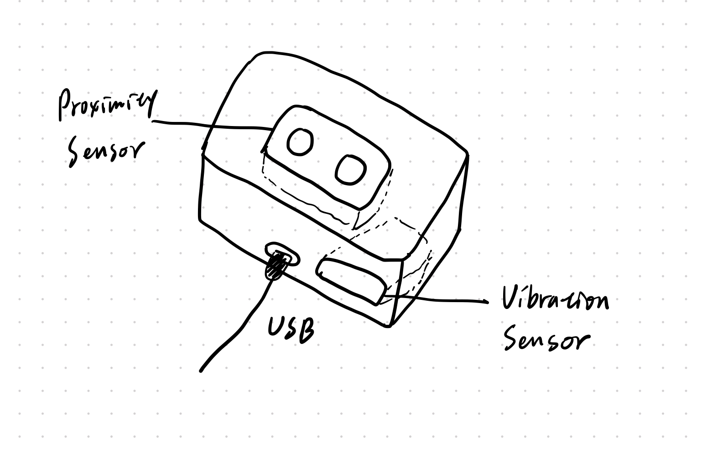
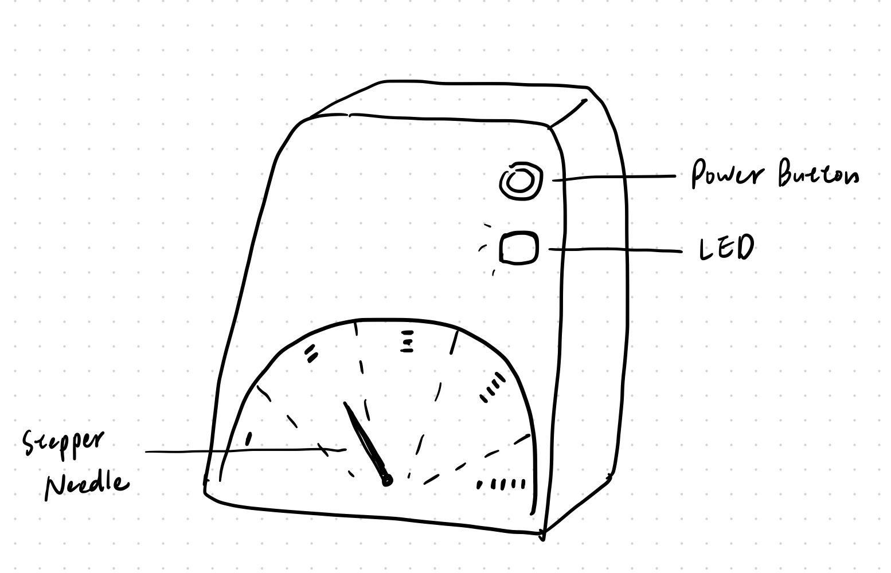
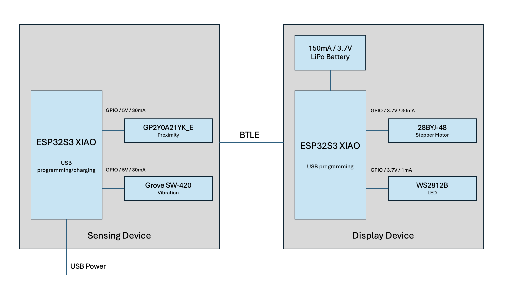

# Final Project - Hardware/Software Lab

## Focus Track
The product is a desktop companion device designed to enhance productivity and well-being while working. It sits beside the user's computer and uses sensors to monitor typing patterns and screen time. By analyzing typing speed and consistency, it identifies whether the user is focused on productive tasks or engaging in non-work-related activities. The device features:
- Focus Level Indicator: A needle-style display that reflects the user's focus level based on typing behavior, encouraging sustained productivity.
- Break Reminder System: An LED light that gently alerts the user when they've been at their screen for too long, promoting healthier work habits through regular breaks.

## Sensor Device
The sensor device combines a vibration sensor and a proximity sensor to enable analysis of focus and screen usage.
- The vibration sensor detects typing actions, analyzing patterns to determine whether the user is typing productively.
- The proximity sensor tracks the user's presence in front of the screen to monitor screen time.

## Display Device
The display device interacts with the user through physical interfaces.
- The button allows the user to turn the device on or off.
- The needle indicator displays productivity levels, calculated based on typing patterns.
- The blinking LED light serves as a reminder to take breaks when screen time becomes excessive.

## Communication

